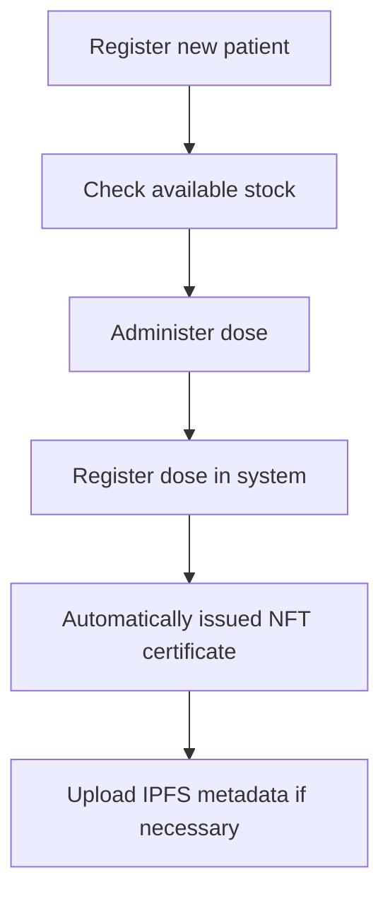
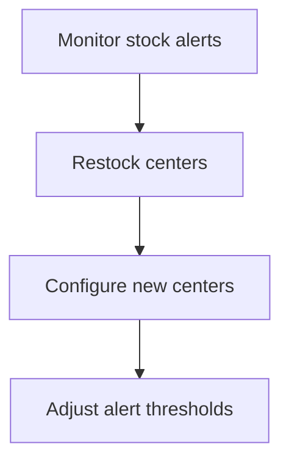

# Documentation Technique - Blockchain Vaccine Registry

## Table of Contents

1. [Overview](#overview)
2. [System Architecture](#system-architecture)
3. [Initial Configuration](#initial-configuration)
4. [Role Management](#role-management)
5. [Inventory Management](#inventory-management)
6. [Patient Registration](#patient-registration)
7. [Dose Administration](#dose-administration)
8. [DAO Governance](#dao-governance)
9. [IPFS Metadata Management](#ipfs-metadata-management)
10. [Troubleshooting](#troubleshooting)

---

## Overview

The Blockchain Vaccine Registry is a decentralized vaccination management system using blockchain technology to ensure the traceability, security, and transparency of vaccination data.

### Main Components

- **VaccineRegistry**: Main contract for patient and dose registration
- **VaccineStock**: Vaccine inventory management by medical center
- **VaccineGovToken (VGOV)**: Governance token for the DAO
- **VaccineDAO**: Decentralized system governance
- **Web Interface**: Next.js application for user interaction

---

## System Architecture

### Smart Contracts

```
Vaccine Registry (0xb1a2546577fB56B31aa515de273EE89C14D0461E)
├── Patient Registration
├── Dose Administration
├── NFT Certificate Issuance
└── AEFI (Adverse Event) Reporting

VaccinStock
├── Medical Center Management
├── Inventory Configuration by Vaccine Type
├── Stock Review Alerts
└── Stock Movement Tracking

VaccineGovToken (VGOV)
├── ERC-20 Token with Voting
├── Delegation of Voting Authority
└── Owner-Managed Offering

VaccinDAO
├── Governance Proposals
├── Voting System
├── Decision Enforcement
└── Contract Configuration
```

### Roles and Permissions

| Role | Contract | Permissions |
|------|---------|-------------|
| `ADMIN_ROLE` | Registry/Stock | Complete management, role assignment |
| `MEDICAL_AGENT_ROLE` | Registry | Patient registration, dose administration, MAPI |
| `LOGISTIC_MANAGER_ROLE` | Stock | Stock management, center configuration |

---

## Initial Setup

### 1. Wallet Connection

1. Click "Connect MetaMask" in the header
2. Authorize the connection in MetaMask
3. Verify that you are on the correct network (Hedera Testnet)

### 2. Environment Variable Configuration

Make sure the `.env` file contains :

```env
NEXT_PUBLIC_CONTRACT_VACCINE_REGISTRY_ADDRESS=0xb1a2546577fB56B31aa515de273EE89C14D0461E
NEXT_PUBLIC_CONTRACT_VACCINE_STOCK_ADDRESS=<stock_contract_address>
NEXT_PUBLIC_CONTRACT_VACCINE_GOV_TOKEN_ADDRESS=<vgov_token_address>
NEXT_PUBLIC_CONTRACT_VACCINE_DAO_ADDRESS=<dao_address>
NEXT_PUBLIC_NETWORK=hedera-testnet
PINATA_API_KEY=<your_pinata_key>
PINATA_API_SECRET=<your_secret_pinata>
```

### 3. Assigning Initial Roles

An administrator must assign roles via the "Roles" section:

1. Go to the "Roles" section
2. Select the contract (Registry or Stock)
3. Choose the role to assign
4. Enter the recipient's address
5. Click "Grant Role"

---

## Role Management

### Assigning a Role

**Prerequisite**: Must have the `ADMIN_ROLE` role

1. **Navigation**: Go to the "Roles" section
2. **Contract Selection**: Choose "Registry Contract" or "Stock Contract"
3. **Role Selection**:
- `ADMIN_ROLE`: Full access
- `MEDICAL_AGENT_ROLE`: For medical agents
- `LOGISTIC_MANAGER_ROLE`: For logistics managers
4. **User Address**: Enter the address Recipient's blockchain
5. Validation: Click "Grant Role"

### Role Verification

Your current roles are displayed at the top of the "Roles" section with colored badges:
- ✅ Green: Role granted
- ❌ Gray: Role not granted

---

## Inventory Management

### Setting up a new center

**Prerequisites**: `ADMIN_ROLE` or `LOGISTIC_MANAGER_ROLE`

1. **Navigation**: "Inventory Management" section → "Medical Centers" tab
2. **Add**: In "Configuration", select a center
3. **Vaccine Type**: Choose the type (must be configured beforehand)
4. **Initial Stock**: Set the initial quantity
5. **Alert Threshold**: Set the critical threshold (e.g., 10)
6. **Validation**: Click on "Configure Inventory" Vaccine

### Daily Inventory Management

#### Adding Inventory
- Use the "Add 10" buttons on each center card
- Or use the "addStock" function for custom quantities

#### Stock Withdrawal
- Use the "Withdraw 1" buttons in each center card
- Automatically when a dose is administered

#### Alert Monitoring
- Critical stocks appear in red
- An alert icon ⚠️ indicates centers in critical situations
- The system automatically issues "CriticalStockAlert" events

---

## Patient Registration

### New Patient

**Prerequisites**: `MEDICAL_AGENT_ROLE` Role

1. **Navigation**: "Patients" section → "Register Patient" tab
2. **Address**: Enter the patient's blockchain address
3. **Unique Code**: Create a unique identifier (e.g., PAT-001)
4. **Professional Category**: Select from the list
5. **Validation**: Click on "Register Patient"

### Consulting Patients

1. Navigation: "Patients" section → "Patient List" tab
2. Search: Use the search bar to filter
3. Details: Click "Details" to view the complete history
4. Print: Use the "Print List" button to generate a report

---

## Dose Administration

### Recording a Dose

**Prerequisites**: MEDICAL_AGENT_ROLE + Available Stock

1. **Navigation**: "Patients" section → "Record Dose" tab
2. **Patient Code**: Enter the existing patient code
3. **Vaccine Type**: Select from the configured list
4. **Center ID**: Administration center identifier
5. **Batch Number**: Vaccine traceability (e.g., BATCH-2024-001)
6. **Metadata**: Optional IPFS URI for additional documents
7. **Validation**: Click "Record Dose"

### Automatic Process

When recording a dose:
1. ✅ Verification of patient existence
2. ✅ Verification of available stock
3. ✅ Automatic stock decrement
4. ✅ Issuance of an NFT certificate upon full vaccination
5. ✅ Issuance of blockchain events for traceability

---

## DAO Governance

### Participation in Voting

**Prerequisites**: Hold VGOV tokens

1. **Navigation**: "DAO Governance" section
2. **Consultation**: View active proposals
3. **Vote**: Choose "For", "Against", or "Abstain"
4. **Confirmation**: Validate the transaction in MetaMask

### Creating Proposals

**Prerequisites**: Minimum VGOV Token Threshold

1. **Navigation**: "DAO Governance" section → "Create Proposal" tab
2. **Title**: Descriptive title of the proposal
3. **Description**: Detailed explanation of the changes
4. **Action Type**: Select the proposal type
5. **Settings**: Configure according to the chosen type
6. **Submission**: Click "Create Proposal"

### Available Proposal Types

- **Custom Action**: Function call on a specific contract
- **Add Vaccine Type**: New vaccine in the registry
- **Modify Quorum**: Change voting rules
- **Grant Role**: Grant permissions

---

## IPFS Metadata Management

### File Upload

**Prerequisites**: Role `MEDICAL_AGENT_ROLE` + Pinata Configuration

1. Navigation: "Metadata" section
2. File Name: Custom name (optional)
3. Selection: Select the file (PDF, JPG, PNG, TXT, JSON)
4. Upload: The file is automatically uploaded to IPFS
5. Retrieve: Copy the IPFS hash or view the file

### Certificate Metadata

1. **Document Name**: Certificate Title
2. **Description**: Detailed Description
3. **Patient Code**: Patient Reference
4. **Document Type**: Category (certificate, medical report, etc.)
5. **Generation**: Automatic JSON Metadata Generation

---

## Advanced Configuration

### Adding Vaccine Types

**Prerequisites**: `ADMIN_ROLE` or `MEDICAL_AGENT_ROLE` Role

1. **Navigation**: "Configuration" Section → "Vaccine Types" Tab
2. **Name**: Short name of the vaccine (e.g., MPOX)
3. **Required Doses**: Number of doses for full vaccination (1-10)
4. **Add**: Click "Add Vaccine Type"

### Adding Medical Centers

**Prerequisites**: Role `ADMIN_ROLE` or `LOGISTIC_MANAGER_ROLE`

1. Navigation: "Configuration" section → "Medical Centers" tab
2. Center ID: Unique identifier (e.g., CENTRE_PARIS_01)
3. Add: Click "Add Center"

### Contract Configuration

**Prerequisites**: `ADMIN_ROLE` Role

#### Registry ↔ Stock Link
1. **Navigation**: "Contract Management" section
2. **Stock Address**: Enter the VaccineStock contract address
3. **Configuration**: Click "Configure Contract"

#### DAO Configuration
1. **Registry in DAO**: Configure the Registry address
2. **Stock in DAO**: Configure the Stock address

---

## Recommended Workflow

### 1. Initial Configuration (Administrator)

```mermaid
graph TD
A[Deploy Contracts] --> B[Configure .env]
B --> C[Assign Initial Roles]
C --> D[Add Vaccine Types]
D --> E[Add Medical Centers]
E --> F[Configure Stocks] initials]
F --> G[Link contracts]
```


### 2. Daily Use (Medical Agent)



### 3. Logistics Management (Manager)



---

## Contract API

### VaccineRegistry

#### Main Functions

```solidity
// Patient registration
function registerPatient(
address patientAddress,
string memory uniquePatientCode,
string memory professionalCategory
) external onlyRole(MEDICAL_AGENT_ROLE)

// Recording a dose
function registerDose(
    string memory uniquePatientCode,
    bytes32 vaccinationTypeId,
    string memory centerId,
    string memory batchNumber,
    string memory metadataURI
) external onlyRole(MEDICAL_AGENT_ROLE)

// Adding a vaccine type
function addVaccinationType(
    string memory name,
    uint8 requiredDoses
) external onlyRole(ADMIN_ROLE)
```
### VaccineStock

#### Main functions

```solidity
// Adding a center
function addCenter(string memory centerId) external onlyRole(LOGISTIC_MANAGER_ROLE)

// Stock configuration
function configureVaccineStock(
    string memory centerId,
    bytes32 vaccinationTypeId,
    uint256 initialQuantity,
    uint256 criticalThreshold
) external onlyRole(LOGISTIC_MANAGER_ROLE)

// Adding stock
function addStock(
    string memory centerId,
    bytes32 vaccinationTypeId,
    uint256 quantityToAdd
) external onlyRole(LOGISTIC_MANAGER_ROLE)
```

---

## Common Error Handling

### Connection Errors

**Issue**: "MetaMask is not installed"
**Solution**: Install the MetaMask extension in your browser

**Issue**: "Wrong network"
**Solution**: Switch to Hedera Testnet in MetaMask

### Permissions Errors

**Issue**: "AccessControlUnauthorizedAccount"
**Solution**: Ask an administrator to assign you the appropriate role

**Issue**: "GovernorInsufficientProposerVotes"
**Solution**: Obtain more VGOV tokens to reach the proposal threshold

### Stock Errors

**Issue**: "InsufficientStock"
**Solution**: Restock the center before administering the dose

**Issue**: "VaccineTypeNotConfiguredForCenter"
**Solution**: Configure the vaccine type for this center in the management stocks

### Patient Errors

**Issue**: "PatientAlreadyExists"
**Solution**: Use a different unique patient ID

**Issue**: "PatientNotFound"
**Solution**: Verify that the patient is registered correctly

---

## Best Practices

### Security

1. **Role Verification**: Always check permissions before sensitive actions
2. **Data Validation**: Check address formats and patient IDs
3. **Key Backup**: Secure MetaMask private keys
4. **Transaction Audit**: Verify transactions on the blockchain explorer

### Performance

1. **Pagination**: Use pagination for important lists
2. **Local Cache**: Data is cached to avoid repeated calls
3. **Auto-Refresh**: Balances and statuses are updated automatically

### Traceability

1. **Blockchain Events**: All events are recorded on the blockchain
2. **IPFS Metadata**: Documents stored decentrally
3. **NFT Certificates**: Cryptographic proof of vaccinations

---

## Monitoring and Maintenance

### Inventory Monitoring

- Regularly check critical stock alerts
- Configure appropriate alert thresholds (recommended: 10-20% of maximum stock)
- Use filters and sorting to quickly identify centers in difficulty

### Patient Monitoring

- Regularly export the patient list
- Monitor issued NFT certificates
- Check vaccination history for compliance

### Governance

- Participate in DAO votes to maintain decentralization
- Suggest improvements via the governance system
- Monitor the execution of adopted proposals

---

## IPFS Integration

### Pinata Configuration

1. Create an account on [Pinata](https://pinata.cloud)
2. Generate your API keys
3. Add them to the `.env` file

### Supported File Types

- **PDF**: Certificates, medical reports
- **Images**: JPG, PNG for document photos
- **JSON**: Structured metadata
- **Text**: Plain text documents

---

## Advanced Troubleshooting

### Transaction Issues

1. **Insufficient Gas**: Increase the gas limit in MetaMask
2. **Failed Transaction**: Check the error logs in the console
3. **Incorrect Nonce**: Reset the account in MetaMask

### Sync Issues

1. **Stale Data**: Refresh the page or reconnect the wallet
2. **Missed Events**: Check the network connection
3. **Inconsistent State**: Check transactions in the blockchain explorer

### Technical Support

For assistance:
1. Check the browser console logs (F12)
2. Check transactions in the Hedera Explorer
3. Contact the development team with error details

---

## Appendices

### Blockchain Error Codes

| Code | Meaning | Recommended Action |
|------|---------------|-------------------|
| 4001 | Transaction rejected by user | Retry transaction |
| 4100 | Account not authorized | Check permissions |
| 4200 | Method not supported | Check contract version |

### Environment Variables

| Varies | Description | Example |
|---------|-------------|---------|
| `NEXT_PUBLIC_CONTRACT_VACCINE_REGISTRY_ADDRESS` | Registry contract address | 0xb1a2546577fB56B31aa515de273EE89C14D0461E |
| `NEXT_PUBLIC_CONTRACT_VACCINE_STOCK_ADDRESS` | Stock contract address | 0x... |
| `NEXT_PUBLIC_CONTRACT_VACCINE_GOV_TOKEN_ADDRESS` | VGOV token address | 0x... |
| `NEXT_PUBLIC_CONTRACT_VACCINE_DAO_ADDRESS` | DAO contract address | 0x... |
| `PINATA_API_KEY` | Pinata API Key | your_key |
| `PINATA_API_SECRET` | Pinata API Secret | your_secret |

---

*Documentation updated on: $(date)*
*Application version: 1.0.0*
