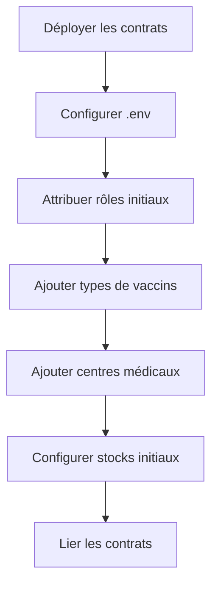
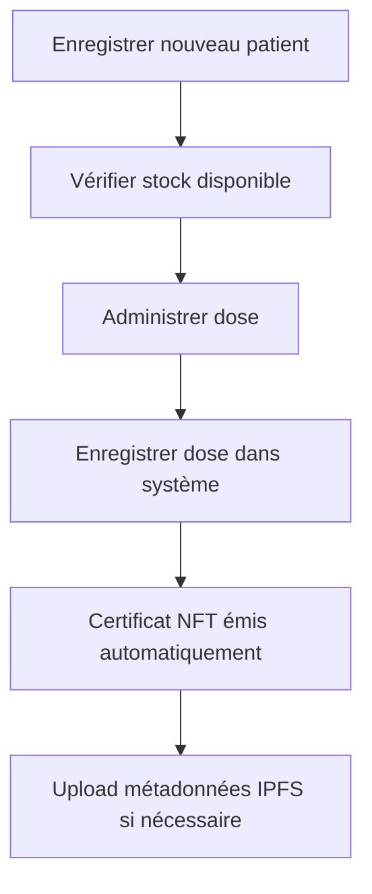
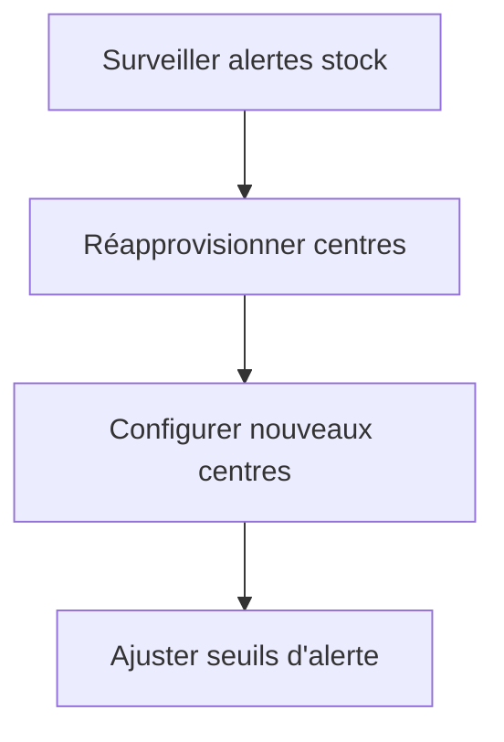

# Documentation Technique - Registre Vaccinal Blockchain

## Table des matières

1. [Vue d'ensemble](#vue-densemble)
2. [Architecture du système](#architecture-du-système)
3. [Configuration initiale](#configuration-initiale)
4. [Gestion des rôles](#gestion-des-rôles)
5. [Gestion des stocks](#gestion-des-stocks)
6. [Enregistrement des patients](#enregistrement-des-patients)
7. [Administration des doses](#administration-des-doses)
8. [Gouvernance DAO](#gouvernance-dao)
9. [Gestion des métadonnées IPFS](#gestion-des-métadonnées-ipfs)
10. [Dépannage](#dépannage)

---

## Vue d'ensemble

Le Registre Vaccinal Blockchain est un système décentralisé de gestion des vaccinations utilisant la technologie blockchain pour assurer la traçabilité, la sécurité et la transparence des données de vaccination.

### Composants principaux

- **VaccineRegistry** : Contrat principal pour l'enregistrement des patients et des doses
- **VaccineStock** : Gestion des stocks de vaccins par centre médical
- **VaccineGovToken (VGOV)** : Token de gouvernance pour la DAO
- **VaccineDAO** : Gouvernance décentralisée du système
- **Interface Web** : Application Next.js pour l'interaction utilisateur

---

## Architecture du système

### Contrats intelligents

```
VaccineRegistry (0xb1a2546577fB56B31aa515de273EE89C14D0461E)
├── Enregistrement des patients
├── Administration des doses
├── Émission de certificats NFT
└── Déclaration des MAPI (événements indésirables)

VaccineStock
├── Gestion des centres médicaux
├── Configuration des stocks par type de vaccin
├── Alertes de stock critique
└── Suivi des mouvements de stock

VaccineGovToken (VGOV)
├── Token ERC-20 avec fonctionnalités de vote
├── Délégation de pouvoir de vote
└── Gestion de l'offre par le propriétaire

VaccineDAO
├── Propositions de gouvernance
├── Système de vote
├── Exécution des décisions
└── Configuration des contrats
```

### Rôles et permissions

| Rôle | Contrat | Permissions |
|------|---------|-------------|
| `ADMIN_ROLE` | Registry/Stock | Gestion complète, attribution des rôles |
| `MEDICAL_AGENT_ROLE` | Registry | Enregistrement patients, administration doses, MAPI |
| `LOGISTIC_MANAGER_ROLE` | Stock | Gestion stocks, configuration centres |

---

## Configuration initiale

### 1. Connexion du portefeuille

1. Cliquez sur "Connecter MetaMask" dans l'en-tête
2. Autorisez la connexion dans MetaMask
3. Vérifiez que vous êtes sur le bon réseau (Hedera Testnet)

### 2. Configuration des variables d'environnement

Assurez-vous que le fichier `.env` contient :

```env
NEXT_PUBLIC_CONTRACT_VACCINE_REGISTRY_ADDRESS=0xb1a2546577fB56B31aa515de273EE89C14D0461E
NEXT_PUBLIC_CONTRACT_VACCINE_STOCK_ADDRESS=<adresse_du_contrat_stock>
NEXT_PUBLIC_CONTRACT_VACCINE_GOV_TOKEN_ADDRESS=<adresse_du_token_vgov>
NEXT_PUBLIC_CONTRACT_VACCINE_DAO_ADDRESS=<adresse_du_dao>
NEXT_PUBLIC_NETWORK=hedera-testnet
PINATA_API_KEY=<votre_clé_pinata>
PINATA_API_SECRET=<votre_secret_pinata>
```

### 3. Attribution des rôles initiaux

Un administrateur doit attribuer les rôles via la section "Roles" :

1. Accédez à la section "Roles"
2. Sélectionnez le contrat (Registry ou Stock)
3. Choisissez le rôle à attribuer
4. Saisissez l'adresse du destinataire
5. Cliquez sur "Grant Role"

---

## Gestion des rôles

### Attribution d'un rôle

**Prérequis** : Avoir le rôle `ADMIN_ROLE`

1. **Navigation** : Allez dans la section "Roles"
2. **Sélection du contrat** : Choisissez "Registry Contract" ou "Stock Contract"
3. **Choix du rôle** :
   - `ADMIN_ROLE` : Accès complet
   - `MEDICAL_AGENT_ROLE` : Pour les agents médicaux
   - `LOGISTIC_MANAGER_ROLE` : Pour les gestionnaires logistiques
4. **Adresse utilisateur** : Saisissez l'adresse blockchain du destinataire
5. **Validation** : Cliquez sur "Grant Role"

### Vérification des rôles

Vos rôles actuels sont affichés en haut de la section "Roles" avec des badges colorés :
- ✅ Vert : Rôle accordé
- ❌ Gris : Rôle non accordé

---

## Gestion des stocks

### Configuration d'un nouveau centre

**Prérequis** : Rôle `ADMIN_ROLE` ou `LOGISTIC_MANAGER_ROLE`

1. **Navigation** : Section "Gestion des stocks" → Onglet "Centres médicaux"
2. **Ajout** : Dans "Configuration", sélectionnez un centre
3. **Type de vaccin** : Choisissez le type (doit être configuré au préalable)
4. **Stock initial** : Définissez la quantité initiale
5. **Seuil d'alerte** : Définissez le seuil critique (ex: 10)
6. **Validation** : Cliquez sur "Configurer le stock de vaccin"

### Gestion quotidienne des stocks

#### Ajout de stock
- Utilisez les boutons "Ajouter 10" dans chaque carte de centre
- Ou utilisez la fonction `addStock` pour des quantités personnalisées

#### Retrait de stock
- Utilisez les boutons "Retirer 1" dans chaque carte de centre
- Automatique lors de l'administration d'une dose

#### Surveillance des alertes
- Les stocks critiques apparaissent en rouge
- Une icône d'alerte ⚠️ indique les centres en situation critique
- Le système émet des événements `CriticalStockAlert` automatiquement

---

## Enregistrement des patients

### Nouveau patient

**Prérequis** : Rôle `MEDICAL_AGENT_ROLE`

1. **Navigation** : Section "Patients" → Onglet "Enregistrer patient"
2. **Adresse** : Saisissez l'adresse blockchain du patient
3. **Code unique** : Créez un identifiant unique (ex: PAT-001)
4. **Catégorie professionnelle** : Sélectionnez dans la liste
5. **Validation** : Cliquez sur "Enregistrer patient"

### Consultation des patients

1. **Navigation** : Section "Patients" → Onglet "Liste des patients"
2. **Recherche** : Utilisez la barre de recherche pour filtrer
3. **Détails** : Cliquez sur "Détails" pour voir l'historique complet
4. **Impression** : Utilisez le bouton "Imprimer la liste" pour générer un rapport

---

## Administration des doses

### Enregistrement d'une dose

**Prérequis** : Rôle `MEDICAL_AGENT_ROLE` + Stock disponible

1. **Navigation** : Section "Patients" → Onglet "Enregistrer dose"
2. **Code patient** : Saisissez le code du patient existant
3. **Type de vaccin** : Sélectionnez dans la liste configurée
4. **Centre ID** : Identifiant du centre d'administration
5. **Numéro de lot** : Traçabilité du vaccin (ex: BATCH-2024-001)
6. **Métadonnées** : URI IPFS optionnel pour documents additionnels
7. **Validation** : Cliquez sur "Enregistrer dose"

### Processus automatique

Lors de l'enregistrement d'une dose :
1. ✅ Vérification de l'existence du patient
2. ✅ Vérification du stock disponible
3. ✅ Décrément automatique du stock
4. ✅ Émission d'un certificat NFT si vaccination complète
5. ✅ Émission d'événements blockchain pour traçabilité

---

## Gouvernance DAO

### Participation aux votes

**Prérequis** : Détenir des tokens VGOV

1. **Navigation** : Section "Gouvernance DAO"
2. **Consultation** : Visualisez les propositions actives
3. **Vote** : Choisissez "Pour", "Contre" ou "Abstention"
4. **Confirmation** : Validez la transaction dans MetaMask

### Création de propositions

**Prérequis** : Seuil minimum de tokens VGOV

1. **Navigation** : Section "Gouvernance DAO" → Onglet "Créer une proposition"
2. **Titre** : Titre descriptif de la proposition
3. **Description** : Explication détaillée des changements
4. **Type d'action** : Sélectionnez le type de proposition
5. **Paramètres** : Configurez selon le type choisi
6. **Soumission** : Cliquez sur "Créer la proposition"

### Types de propositions disponibles

- **Action personnalisée** : Appel de fonction sur contrat spécifique
- **Ajouter un type de vaccin** : Nouveau vaccin dans le registre
- **Modifier le quorum** : Changement des règles de vote
- **Accorder un rôle** : Attribution de permissions

---

## Gestion des métadonnées IPFS

### Upload de fichiers

**Prérequis** : Rôle `MEDICAL_AGENT_ROLE` + Configuration Pinata

1. **Navigation** : Section "Métadonnées"
2. **Nom du fichier** : Nom personnalisé (optionnel)
3. **Sélection** : Choisissez le fichier (PDF, JPG, PNG, TXT, JSON)
4. **Upload** : Le fichier est automatiquement uploadé sur IPFS
5. **Récupération** : Copiez le hash IPFS ou visualisez le fichier

### Métadonnées de certificat

1. **Nom du document** : Titre du certificat
2. **Description** : Description détaillée
3. **Code patient** : Référence au patient
4. **Type de document** : Catégorie (certificat, rapport médical, etc.)
5. **Génération** : Création automatique des métadonnées JSON

---

## Configuration avancée

### Ajout de types de vaccins

**Prérequis** : Rôle `ADMIN_ROLE` ou `MEDICAL_AGENT_ROLE`

1. **Navigation** : Section "Configuration" → Onglet "Types de vaccins"
2. **Nom** : Nom court du vaccin (ex: MPOX)
3. **Doses requises** : Nombre de doses pour vaccination complète (1-10)
4. **Ajout** : Cliquez sur "Ajouter le type de vaccin"

### Ajout de centres médicaux

**Prérequis** : Rôle `ADMIN_ROLE` ou `LOGISTIC_MANAGER_ROLE`

1. **Navigation** : Section "Configuration" → Onglet "Centres médicaux"
2. **ID du centre** : Identifiant unique (ex: CENTRE_PARIS_01)
3. **Ajout** : Cliquez sur "Ajouter le centre"

### Configuration des contrats

**Prérequis** : Rôle `ADMIN_ROLE`

#### Liaison Registry ↔ Stock
1. **Navigation** : Section "Gestion Contrats"
2. **Adresse Stock** : Saisissez l'adresse du contrat VaccineStock
3. **Configuration** : Cliquez sur "Configurer le contrat"

#### Configuration DAO
1. **Registry dans DAO** : Configurez l'adresse du Registry
2. **Stock dans DAO** : Configurez l'adresse du Stock

---

## Flux de travail recommandé

### 1. Configuration initiale (Administrateur)



### 2. Utilisation quotidienne (Agent médical)



### 3. Gestion logistique (Gestionnaire)



---

## API des contrats

### VaccineRegistry

#### Fonctions principales

```solidity
// Enregistrement d'un patient
function registerPatient(
    address patientAddress,
    string memory uniquePatientCode,
    string memory professionalCategory
) external onlyRole(MEDICAL_AGENT_ROLE)

// Enregistrement d'une dose
function registerDose(
    string memory uniquePatientCode,
    bytes32 vaccinationTypeId,
    string memory centerId,
    string memory batchNumber,
    string memory metadataURI
) external onlyRole(MEDICAL_AGENT_ROLE)

// Ajout d'un type de vaccin
function addVaccinationType(
    string memory name,
    uint8 requiredDoses
) external onlyRole(ADMIN_ROLE)
```

### VaccineStock

#### Fonctions principales

```solidity
// Ajout d'un centre
function addCenter(string memory centerId) external onlyRole(LOGISTIC_MANAGER_ROLE)

// Configuration du stock
function configureVaccineStock(
    string memory centerId,
    bytes32 vaccinationTypeId,
    uint256 initialQuantity,
    uint256 criticalThreshold
) external onlyRole(LOGISTIC_MANAGER_ROLE)

// Ajout de stock
function addStock(
    string memory centerId,
    bytes32 vaccinationTypeId,
    uint256 quantityToAdd
) external onlyRole(LOGISTIC_MANAGER_ROLE)
```

---

## Gestion des erreurs courantes

### Erreurs de connexion

**Problème** : "MetaMask is not installed"
**Solution** : Installez l'extension MetaMask dans votre navigateur

**Problème** : "Wrong network"
**Solution** : Changez vers Hedera Testnet dans MetaMask

### Erreurs de permissions

**Problème** : "AccessControlUnauthorizedAccount"
**Solution** : Demandez à un administrateur de vous attribuer le rôle approprié

**Problème** : "GovernorInsufficientProposerVotes"
**Solution** : Obtenez plus de tokens VGOV pour atteindre le seuil de proposition

### Erreurs de stock

**Problème** : "InsufficientStock"
**Solution** : Réapprovisionnez le centre avant d'administrer la dose

**Problème** : "VaccineTypeNotConfiguredForCenter"
**Solution** : Configurez le type de vaccin pour ce centre dans la gestion des stocks

### Erreurs de patients

**Problème** : "PatientAlreadyExists"
**Solution** : Utilisez un code patient unique différent

**Problème** : "PatientNotFound"
**Solution** : Vérifiez que le patient est bien enregistré

---

## Bonnes pratiques

### Sécurité

1. **Vérification des rôles** : Toujours vérifier les permissions avant les actions sensibles
2. **Validation des données** : Contrôler les formats d'adresses et codes patients
3. **Sauvegarde des clés** : Sécuriser les clés privées MetaMask
4. **Audit des transactions** : Vérifier les transactions sur l'explorateur blockchain

### Performance

1. **Pagination** : Utiliser la pagination pour les listes importantes
2. **Cache local** : Les données sont mises en cache pour éviter les appels répétés
3. **Actualisation automatique** : Les soldes et états se mettent à jour automatiquement

### Traçabilité

1. **Événements blockchain** : Tous les événements sont enregistrés sur la blockchain
2. **Métadonnées IPFS** : Documents stockés de manière décentralisée
3. **Certificats NFT** : Preuve cryptographique des vaccinations

---

## Monitoring et maintenance

### Surveillance des stocks

- Consultez régulièrement les alertes de stock critique
- Configurez des seuils d'alerte appropriés (recommandé : 10-20% du stock maximum)
- Utilisez les filtres et tri pour identifier rapidement les centres en difficulté

### Suivi des patients

- Exportez régulièrement la liste des patients
- Surveillez les certificats NFT émis
- Vérifiez l'historique des vaccinations pour la conformité

### Gouvernance

- Participez aux votes DAO pour maintenir la décentralisation
- Proposez des améliorations via le système de gouvernance
- Surveillez l'exécution des propositions adoptées

---

## Intégration IPFS

### Configuration Pinata

1. Créez un compte sur [Pinata](https://pinata.cloud)
2. Générez vos clés API
3. Ajoutez-les dans le fichier `.env`

### Types de fichiers supportés

- **PDF** : Certificats, rapports médicaux
- **Images** : JPG, PNG pour photos de documents
- **JSON** : Métadonnées structurées
- **Texte** : Documents texte simples

---

## Dépannage avancé

### Problèmes de transaction

1. **Gas insuffisant** : Augmentez la limite de gas dans MetaMask
2. **Transaction échouée** : Vérifiez les logs d'erreur dans la console
3. **Nonce incorrect** : Réinitialisez le compte dans MetaMask

### Problèmes de synchronisation

1. **Données obsolètes** : Actualisez la page ou reconnectez le portefeuille
2. **Événements manqués** : Vérifiez la connexion réseau
3. **État incohérent** : Vérifiez les transactions sur l'explorateur blockchain

### Support technique

Pour obtenir de l'aide :
1. Consultez les logs de la console navigateur (F12)
2. Vérifiez les transactions sur l'explorateur Hedera
3. Contactez l'équipe de développement avec les détails de l'erreur

---

## Annexes

### Codes d'erreur blockchain

| Code | Signification | Action recommandée |
|------|---------------|-------------------|
| 4001 | Transaction rejetée par l'utilisateur | Réessayer la transaction |
| 4100 | Compte non autorisé | Vérifier les permissions |
| 4200 | Méthode non supportée | Vérifier la version du contrat |

### Variables d'environnement

| Variable | Description | Exemple |
|----------|-------------|---------|
| `NEXT_PUBLIC_CONTRACT_VACCINE_REGISTRY_ADDRESS` | Adresse du contrat Registry | 0xb1a2546577fB56B31aa515de273EE89C14D0461E |
| `NEXT_PUBLIC_CONTRACT_VACCINE_STOCK_ADDRESS` | Adresse du contrat Stock | 0x... |
| `NEXT_PUBLIC_CONTRACT_VACCINE_GOV_TOKEN_ADDRESS` | Adresse du token VGOV | 0x... |
| `NEXT_PUBLIC_CONTRACT_VACCINE_DAO_ADDRESS` | Adresse du contrat DAO | 0x... |
| `PINATA_API_KEY` | Clé API Pinata | votre_clé |
| `PINATA_API_SECRET` | Secret API Pinata | votre_secret |

---

*Documentation mise à jour le : $(date)*
*Version de l'application : 1.0.0*